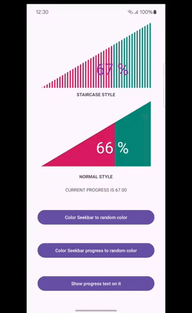

# Android Triangle Seekbar

A simple, lightweight, and customizable Triangle SeekBar library for Android. This library offers a unique triangular progress bar style and now includes an additional Stair Style Bar for more flexibility.

[](https://jitpack.io/#milanmaji/android-triangle-seekbar)





## Features

- **Triangle Style**: A visually distinct triangle-shaped seek bar.
- **Stair Style (New)**: A stepped progress bar that simulates a staircase-like progression.
- **Min/Max Values**: Set minimum, maximum, and current progress values.
- Fully customizable via XML attributes or programmatically.


## Attributes
| Attribute | Description | Default Value
| ------ | ------ | ------ |
| `app:seekbarColor` | color of seekbar | `#FFA000` |
| `app:seekbarLoadingColor` | progress color of seekbar |  `#E64A19` |
| `app:stairSpaceColor` | Color between stair steps |  `#00000000` |
| `app:textColor`| progress text color | `#000000` |
| `app:textFontName` | set font for progress text | App Default Font |
| `app:textFontSize` | set font size for progress text | `96f` |
| `app:showProgress` | Should progress text visible or not: `true` or `false` | `false`
| `app:progressTextPosition` | The position of progress text in the seekbar: `topLeft`, `topRight` ,`bottomLeft`,`bottomRight`,`center` | `center` |
| `app:progress` | Current progress value between min and max. | `0.0f`
| `app:minValue` | Minimum value of the seek bar. | `0.0f`
| `app:maxValue` | Minimum value of the seek bar. | `100.0f`
| `app:stairBarLineWidth` | Width of each stair step. | `6.0f`
| `app:barStyle` | Sets the bar style: `fill` or `stair`. | `fill`


## Installation

Add it in `settings.gradle.kts`:
``` gradle
	dependencyResolutionManagement {
		repositories {
			...
			maven(url = "https://jitpack.io")
		}
	}
```
and then add dependency in `build.gradle.kts`

``` gradle
	dependencies {
	        implementation("com.github.milanmaji:android-triangle-seekbar:latest.version")
	}
```

## Usage

**[1. XML](./app/src/main/res/layout/activity_main.xml)**

Define the TriangleSeekBar in your layout:

``` xml

    <com.github.milanmaji.triangleseekbar.TriangleSeekbar
        android:id="@+id/triangleSeekbar"
        android:layout_width="match_parent"
        android:layout_height="180dp"
        app:maxValue="100"
        app:minValue="0"
        app:progress="50"
        app:progressTextPosition="center"
        app:seekbarColor="@color/colorPrimary"
        app:seekbarLoadingColor="@color/colorAccent"
        app:showProgress="true"
        app:barStyle="fill"
        app:textColor="#ffffff"
        app:textFontSize="48sp" />

```
### [1. Kotlin Code](./app/src/main/java/com/github/milanmaji/sample/MainActivity.kt)

In your code you add listener to progress change:
``` kotlin

binding.triangleSeekbar.setProgressListener(
            object : TriangleSeekbar.ProgressListener {
                override fun onProgressChange(progress: Float) {
                    //binding.tvCurrentProgress.text = getString(R.string.current_progress_is, progress)
                    Log.d("tag","AndroidTriangleSeekbar:$progress")
                }

            }
        )

```


## Contributing

Contributions are always welcome!\
Feel free to submit issues or pull requests.


## License

Forked from [TriangleSeekbar](https://github.com/agarasul/TriangleSeekbar)
, Copyright 2019 [Rasul Aghakishiyev](https://github.com/agarasul)

Copyright 2024 Milan Maji

Licensed under the Apache License, Version 2.0 (the "License");
you may not use this file except in compliance with the License.
You may obtain a copy of the License at

    http://www.apache.org/licenses/LICENSE-2.0

Unless required by applicable law or agreed to in writing, software
distributed under the License is distributed on an "AS IS" BASIS,
WITHOUT WARRANTIES OR CONDITIONS OF ANY KIND, either express or implied.
See the License for the specific language governing permissions and
limitations under the License.

